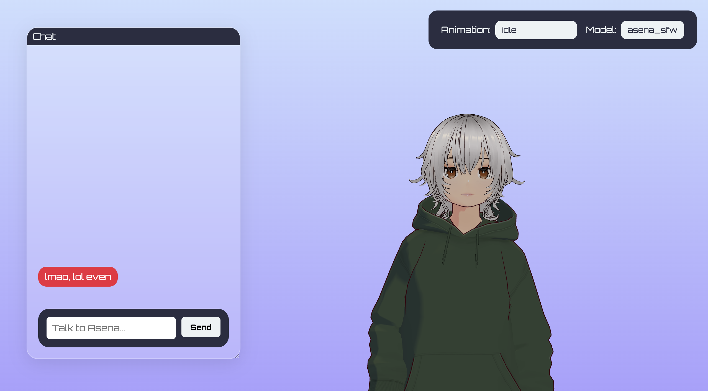
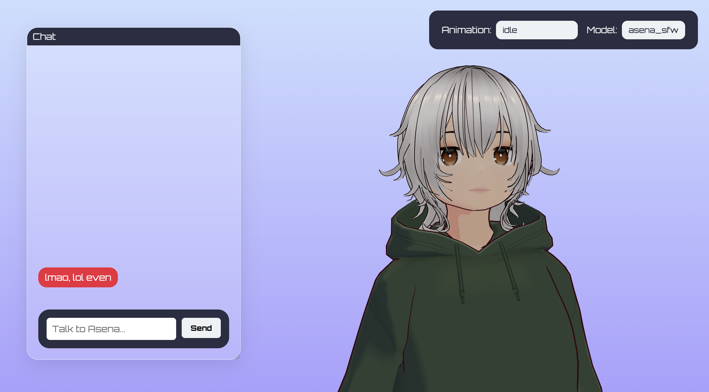

# asena

it's a working progress, but i've decided to commit the first STABLE version. it's basically an lmstudio -> kokoro tts -> rhubarb/dictionary -> three.js wrapper that is supposed to mimic grok [ani](https://www.reddit.com/r/grok/comments/1m7yg3o/just_tried_groks_new_ai_companion_ani_its_kinda/). i know my chances are slim but i'll try anyway. the main bottleneck at the moment is my local computing power. it's much better to run this on a computer with a gpu or more ram, and then use it as a website. if you do that on your own network, the whole thing stays entirely local and private.

problems aside, if this works and is sufficiently fast, you can only imagine the power. the fact that it's running locally means that nobody is datamining you, the fact that you get to pick your llm means you can go as wild as you want with requests. plus it's entirely free and open source so you can add features or play around with it. 

# installation

read the installation.md file. 

# models and animations

i have created the asena_sfw.vrm model myself with vroid studio so i permit all use i don't care what you do with it. it's also really easy to create models with vroid yourself. i just can't upload the mixamo animations because they are under the adobe license. in the animations.json file i have listed a few that you should get, they're entirely free and look really good: https://www.mixamo.com/. just type the name of the animation, download, put into src/animations/.

# current issues

i'm having trouble getting the llms to consistently output good action and emotion tags. it's probably because i'm working with models of room temp iq but i just don't have the computing power for more. i'll try to prompt bully them into getting better or consider running a more advanced model OR maybe write a manual emotion classifier but that feels really robotic, i've tried it. that's what i'm working on in the emotion_classifier.js file. 

i also have to wait at least half a minute for longer responses, where most of the time is taken up by text-to-speech generation and it makes debugging and playtesting a pain.

# todo

- [x] action system, let ai control the animations
- [ ] memory system
- [x] run kokoro at least on big pc, try to build
– [x] clean building and installation haha
- [ ] 30000 iq model gaslighting strategy: inject tags into history randomly
- [ ] beware of cap conventions with parameters ("Surprise" and "surprise")
- [ ] keep track of token count and context window explosion
- [x] untrimmed anims from mixamo
- [ ] keep track of a backend message_history and a display one

# img

