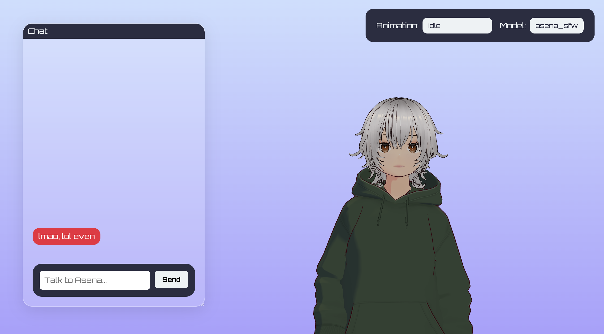
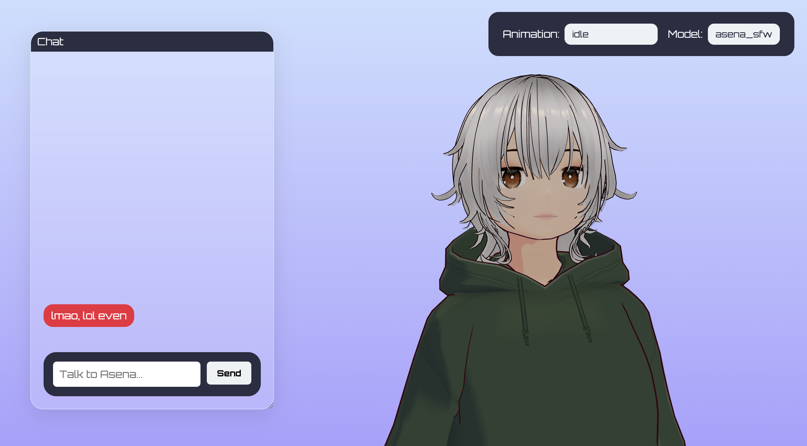

# asena

it's a working progress, but i've decided to commit the first semi-stable version. it's basically an lmstudio -> kokoro tts -> rhubarb -> three.js wrapper that is supposed to mimic grok [ani](https://www.reddit.com/r/grok/comments/1m7yg3o/just_tried_groks_new_ai_companion_ani_its_kinda/). i know my chances are slim but i'll try anyway. the main bottleneck at the moment is my local computing power. i need about 30 seconds to generate 10 words which is terrible. it can be cut back a lot by skipping rhubarb and faking the visemes but then it just looks goofy. 

the plan forward is to rewrite it using streaming from kokoro and faking visemes as i go along. then the only latency would be waiting for the llm response but that's basically always sub-5-seconds.

i also apologise to frontend devs for that amazing gui haha.

that aside, if this works and is sufficiently fast, you can only imagine the power. the fact that it's running locally means that noone is datamining you, the fact that you get to pick your llm means you can go as wild as you want with requests. plus it's entirely free and based open source so you can add features or play around with it. 

# installation

read the installation.md file.

# todo

- [x] action system, let ai control the animations
- [ ] memory system
– [x] clean building and installation haha
- [x] untrimmed anims from mixamo

# img

